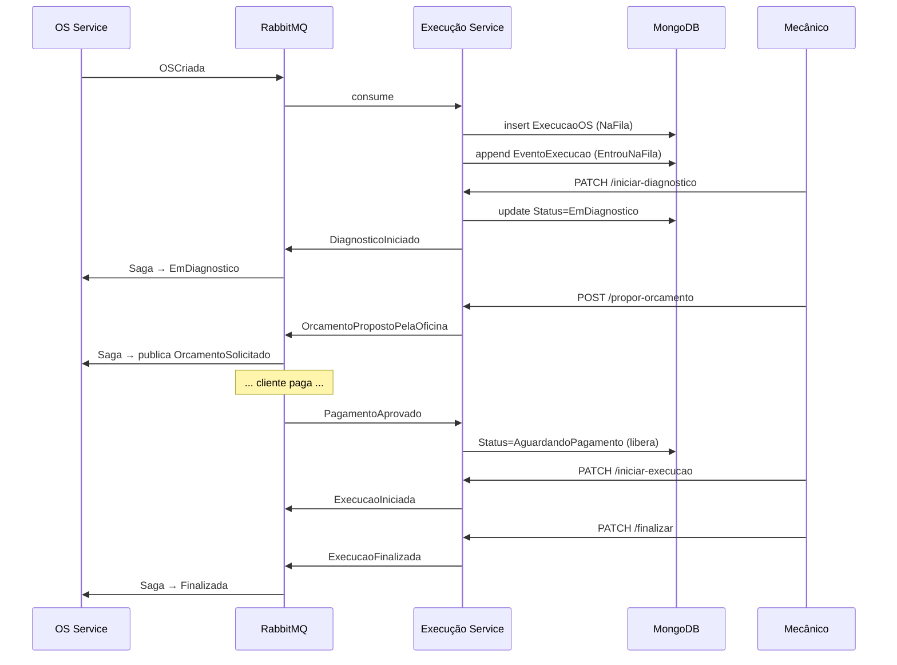

# oficinafiap-execucao-service — Execução Service (fila + histórico)

> Microsserviço de **chão de fábrica** da Oficina FIAP — Fase 4. Gerencia a fila de OSs, transições de status durante diagnóstico/execução, histórico completo de eventos. Usa **MongoDB** como banco — schemaless e ótimo para event log.

---

## Por que MongoDB?

Este serviço atende o requisito **NoSQL** da Fase 4. A escolha do Mongo é técnica, não apenas formal:

- **Fila de trabalho** é leitura por status com filtros simples (perfeito para Mongo)
- **Histórico de eventos** tem payload variável (`Payload Dictionary<string, object?>` vira BsonDocument flexível)
- **Schemaless** facilita adicionar novos tipos de evento sem migration
- Cluster Mongo é **horizontalmente escalável** por sharding (vantagem operacional)

---

## Papel na Saga

Reativo, não orquestrador. Consome eventos do OS Service (`OSCriada`, `OSReprovadaPeloCliente`, `OSCancelada`) e do Billing Service (`PagamentoAprovado`). Publica eventos que avançam a Saga: `DiagnosticoIniciado`, `OrcamentoPropostoPelaOficina`, `ExecucaoIniciada`, `ExecucaoFinalizada`.



---

## Tecnologias

| Item | Versão |
|---|---|
| .NET / ASP.NET Core | 8.0 |
| MongoDB.Driver | 2.27.0 |
| MongoDB 7 | namespace `database-ns` |
| MassTransit + RabbitMQ | 8.3 |
| Serilog JSON + Datadog APM | — |
| MassTransit InMemoryOutbox | (Mongo não suporta outbox SQL — usamos retry policies + idempotência manual) |

---

## Modelo Mongo

### Collection `execucoes`
Um documento por OS. Lifecycle:
```
NaFila → AguardandoDiagnostico → EmDiagnostico → AguardandoOrcamento
→ AguardandoPagamento → EmExecucao → Finalizada
                     ↘ Removida (reprovada/cancelada)
```
Índices: `ix_execucoes_osid` (unique), `ix_execucoes_status`, `ix_execucoes_correlation` (unique)

### Collection `eventos_execucao`
Histórico append-only de eventos. Cada `EventoExecucao` tem `Payload` como `Dictionary<string, object?>` que vira `BsonDocument` no Mongo — schema flexível.
Índice: `ix_eventos_os_tempo` (composto por OS + timestamp)

---

## Endpoints

JWT obrigatório.

| Método | Rota | Descrição |
|---|---|---|
| `GET` | `/api/execucao/fila?status=...` | Lista a fila ordenada por status + tempo |
| `PATCH` | `/api/execucao/{osId}/iniciar-diagnostico` | Mecânico inicia diagnóstico — publica `DiagnosticoIniciado` |
| `POST` | `/api/execucao/{osId}/propor-orcamento` | Mecânico propõe valor — publica `OrcamentoPropostoPelaOficina` (dispara cadeia para o Billing) |
| `PATCH` | `/api/execucao/{osId}/iniciar-execucao` | Após pagamento, mecânico inicia reparo — publica `ExecucaoIniciada` |
| `PATCH` | `/api/execucao/{osId}/finalizar` | Reparo concluído — publica `ExecucaoFinalizada` |
| `GET` | `/api/execucao/{osId}/historico` | Timeline completa de eventos (event log) |
| `GET` | `/health` / `/health/detail` | Health checks (MongoDB + RabbitMQ) |

---

## Idempotência

- **OSCriadaConsumer:** índice unique em `OrdemDeServicoId` + check explícito antes de inserir
- **PagamentoAprovadoConsumer:** transição idempotente (só atualiza se status apropriado)
- **InMemoryOutbox** do MassTransit garante consistência entre commit do Mongo e ack do RabbitMQ dentro do mesmo handler

---

## Eventos

### Consumidos
| Evento | Origem | Ação |
|---|---|---|
| `OSCriada` | OS Service | Adiciona à fila (status `AguardandoDiagnostico`) |
| `PagamentoAprovado` | Billing | Marca `AguardandoPagamento` → libera para execução |
| `OSReprovadaPeloCliente` | OS Service | Remove da fila |
| `OSCancelada` | OS Service | Remove da fila |

### Publicados
| Evento | Quando |
|---|---|
| `DiagnosticoIniciado` | Mecânico iniciou diagnóstico |
| `OrcamentoPropostoPelaOficina` | Mecânico propõe valor — dispara `OrcamentoSolicitado` no OS Service |
| `ExecucaoIniciada` | Mecânico iniciou reparo |
| `ExecucaoFinalizada` | Reparo concluído |

---

## Como rodar localmente

**Pré-requisitos:** .NET 8 SDK, MongoDB local (Docker: `docker run -d --name mongo -p 27017:27017 -e MONGO_INITDB_ROOT_USERNAME=execucao_root -e MONGO_INITDB_ROOT_PASSWORD=devpassword mongo:7`), RabbitMQ rodando.

```bash
dotnet restore
dotnet run --project Oficina.Execucao.Api
# Swagger: http://localhost:5002/swagger
```

Os índices Mongo são criados automaticamente no startup via `MongoContext.EnsureIndexesAsync()`.

---

## Deploy K8s

```bash
kubectl apply -f k8s/configmap.yaml
kubectl apply -f k8s/secrets.yaml
kubectl apply -f k8s/deployment.yaml
kubectl apply -f k8s/service.yaml
kubectl apply -f k8s/hpa.yaml
kubectl apply -f k8s/ingressroute.yaml
```

---

## Repositórios do projeto Fase 4

| Repo | Função |
|---|---|
| [oficinafiap-os-service](https://github.com/aka-kensei/oficinafiap-os-service) | OS + orquestrador Saga |
| [oficinafiap-billing-service](https://github.com/aka-kensei/oficinafiap-billing-service) | Orçamento + Mercado Pago |
| [oficinafiap-execucao-service](https://github.com/aka-kensei/oficinafiap-execucao-service) | **Este** — Fila + diagnóstico/execução + histórico |
| [oficinafiap-lambda](https://github.com/aka-kensei/oficinafiap-lambda) | Auth serverless |
| [oficinafiap-infra-k8s](https://github.com/aka-kensei/oficinafiap-infra-k8s) | Cluster + RabbitMQ |
| [oficinafiap-infra-db](https://github.com/aka-kensei/oficinafiap-infra-db) | Manifestos SQL Server + PostgreSQL + MongoDB |
